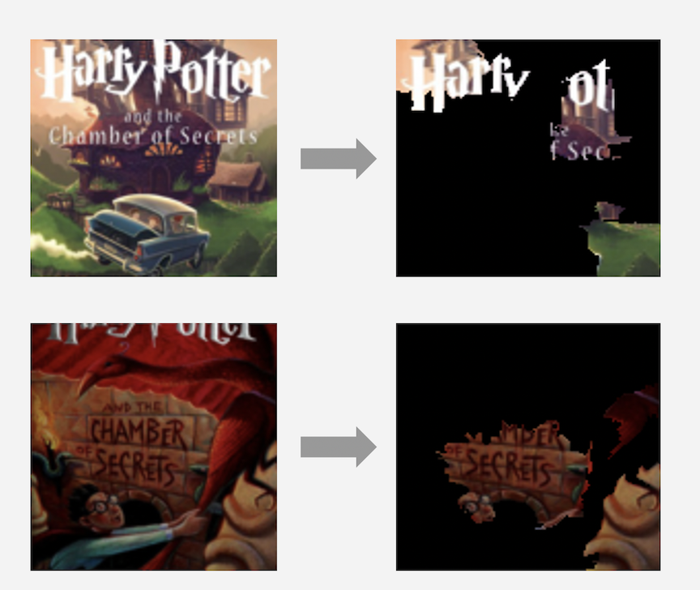
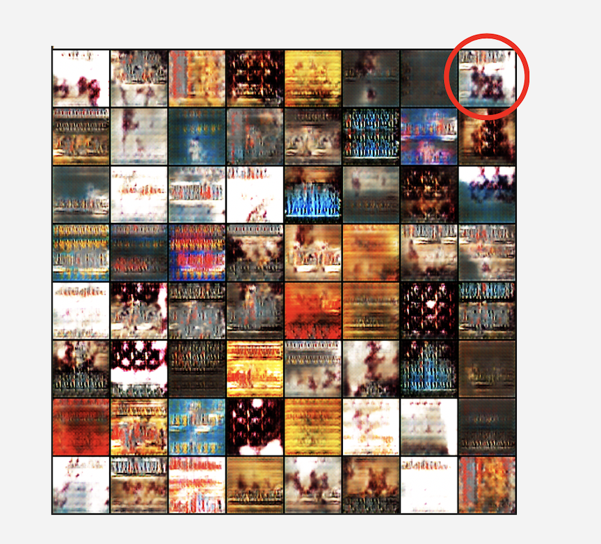

# Judging a book by its cover

## Project Overview

This project employed 3 machine learning techniques to study the relationship between book covers and their popularities. We first trained a classification model using a Convolutional Neural Network (CNN) to predict the popularity level given a resized and randomly cropped 120 * 120 image input of the book cover. Second, we implemented an interpretation algorithm called Local Interpretable Model-Agnostic Explanations (LIME) to extract patches in the image to explain the prediction result. Finally, we explore Generative Adversarial Network (GAN) to generate the most popular cover by machine itself. We found that our classification model suffers from overfitting, and thus, we in general fail to conclude a clear relationship between book cover and popularity. However, given a specific instance, LIME extracted reasonable features to explain the result. And finally, our GAN is able to provide some general tips of what popular book covers have. The full report can be accessed [here](https://github.com/peterwei425/Judging-a-book-by-its-cover/blob/master/Report.pdf). 

## Project Walkthrough

We obtained our dataset from Kaggle’s [Goodreads’ Best Books Ever](https://www.kaggle.com/meetnaren/goodreads-best-books). There are 53,618 images in total. The book cover images are of various sizes with most of them in RGB format. The popularity score was computed by Goodreads based on multiple factors including vote counts and vote scores. 

The project consists of 3 parts: 

- CORAL-CNN to address the problem of classifier inconsistency
- LIME to further understand which. Particular part of the book cover contributes to the books’ popularities
- GAN to study what a popular book looks like 

### CORAL-CNN

We used CNN as the architecture to make predictions of classifications. Specifically, we used ResNet-34, which is a modern CNN architecture with relatively good performance on a variety of classification tasks, as our model. In addition, considering the ordinal property of our response variable (ranging from level 0 to level4), we implemented the framework called [Consistent Rank Logits (CORAL)](https://arxiv.org/abs/1901.07884) to reflect the ordinal information, meanwhile keeping it rank-monotonic. The code for generating dataset for CORAL-CNN can be found [here](https://github.com/peterwei425/Judging-a-book-by-its-cover/blob/master/gen_dataset_cnn.py). And the modeling process can be found [here](https://github.com/peterwei425/Judging-a-book-by-its-cover/blob/master/coral_cnn.py). 

### LIME 

LIME is an algorithm for explaining the result of classification or regression by. Local approximation. Given an observation say a text, an image or a tabular data, LIME extracts feature that are most relevant to the prediction output, and thus, interpret the result. Specifically, for image classification, LIME can present patches in an image to provide quantitative understanding of the relationship between the instance and its prediction label. 

In this project, we applied LIME to answer given a book cover, which parts of the image will explain its output, i.e., the popularity level. Particularly, a successful LIME output will extract patches in the book cover that are most deterministic to its popularity. For example, we compare too different book covers for the same Harry Potter book: Harry Potter and the Chamber of Secrets; Notice that one cover is with main title while the other is not. As you can see below, for the book with main title, LIME detects “Harry”; for the book without main title, LIME detects its subtitle. The code for LIME can be found [here](https://github.com/peterwei425/Judging-a-book-by-its-cover/blob/master/lime_interp.py). 

### GAN

We obtained a set of book covers whose popularity score are relatively higher in the list, and we fed a collection of 32,166 images to the DCGAN for training. We asked the generator to generate fake data from a vector of 100 uniformly random numbers, ranging from 0 to 1. Then, we fed the fake data to the discriminator with fake labels. As a result, a batch of 128 images were created in one of the epochs of our (Deep Convolutional Generative Adversarial Network)DCGAN, which was shown below. For example, for the image circled in red, we can see two people sitting together facing the sea. The code for generating dataset for GAN can be found [here](https://github.com/peterwei425/Judging-a-book-by-its-cover/blob/master/gen_dataset_gan.py). The code for GAN can be found [here](https://github.com/peterwei425/Judging-a-book-by-its-cover/blob/master/dcgan.py). 

This project was awarded as the [Most Creative Project](http://pages.stat.wisc.edu/~sraschka/teaching/stat479-ss2019/#project-presentation-awards) for [STAT 479 (Deep Learning) for Spring 2019](http://pages.stat.wisc.edu/~sraschka/teaching/stat479-ss2019/).

Team: [Boyang Wei](https://www.linkedin.com/in/boyang-wei/),[Yien Xu](https://github.com/yienxu), [Jiongyi Cao](https://www.linkedin.com/in/jiongyi-cao-984711103/)

